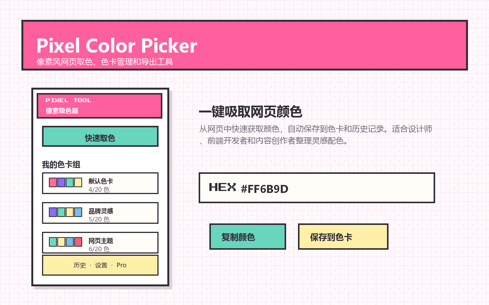
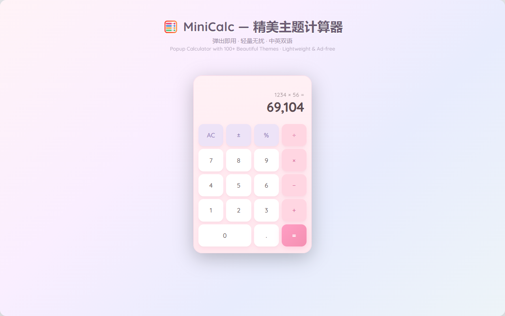

# Chrome 扩展商店素材生成器 | Chrome Extension Store Asset Generator

> 一键生成 Chrome Web Store 截图与宣传图（PNG/JPG）+ 视觉 QA
> One-click Chrome Web Store screenshots & promo images (PNG/JPG) with strict visual QA

<p align="center">
  <a href="LICENSE"></a>
  
</p>

**关键词 / Keywords:** Chrome 扩展 · 商店截图 · 宣传图 · Chrome Web Store · screenshot generator · promo image · CodeBuddy skill · Pillow

> **中文** | [English](#english-version)

一个可复用的 **用户级** CodeBuddy Skill，用于为浏览器扩展 / Web 应用项目生成 Chrome Web Store 截图和宣传图（PNG/JPG）。它基于 PIL 的 Python 流水线，并强制在交付前执行严格的视觉 QA 检查。

A reusable **user-level** CodeBuddy skill that generates Chrome Web Store screenshots and promotional images (PNG/JPG) for browser-extension / web-app projects with a PIL-based Python pipeline, then enforces a strict visual QA checklist before delivery.

---

## 效果预览 | Preview

以下图片均由本 Skill 根据实际扩展的 **UI 风格与功能**生成，并通过了视觉 QA 检查。

> The following images were generated by this skill based on the **actual UI style and features** of the extensions, and passed the visual QA checklist.

### Pixel Color Picker

<p align="center">
  
</p>

### MiniCalc

<p align="center">
  
</p>

---

## 功能 | Features

- 生成 1280×800 商店截图与 440×280 / 1400×560 宣传图。
- 使用像素风字体 `PressStart2P-Regular.ttf` 营造复古 SaaS 视觉。
- 内置 `popup_mock` 组件，支持等比缩放，自动切换小尺寸字号。
- 强制 **生成 → 预览 → 修复 → 重生成** 工作流，确保每张素材都通过 7 项视觉 QA。

- Generates 1280×800 store screenshots and 440×280 / 1400×560 promotional tiles.
- Uses pixel-art font `PressStart2P-Regular.ttf` for a retro SaaS look.
- Built-in `popup_mock` component with scale-aware font sizing.
- Enforces a **generate → preview → fix → regenerate** loop so every asset passes 7 visual QA rules.

---

## 项目结构 | Folder Structure

```
chrome-extension-store-asset-generator/
├── SKILL.md                              # skill 触发 + 工作流（CodeBuddy 必需）
├── scripts/
│   ├── generate-store-screenshots.py    # 1280×800 截图生成器
│   └── generate-store-promo.py          # 440×280 + 1400×560 宣传图生成器
├── references/
│   └── qa-checklist.md                   # 7 项视觉 QA 硬规则
├── examples/                             # 真实项目生成效果预览
├── assets/
│   └── PressStart2P-Regular.ttf          # 像素字体
├── requirements.txt                       # 依赖
├── LICENSE                                # MIT
└── README.md
```

---

## 环境要求 | Prerequisites

- Python 3.10+
- Pillow：

```bash
pip install -r requirements.txt
```

> Windows 用户：脚本会优先使用项目内 `fonts/PressStart2P-Regular.ttf`，否则回退到系统自带的 `msyh.ttc` / `simhei.ttf`。

---

## 用法 | Usage

将该 Skill 复制到 CodeBuddy 用户级 Skill 目录：

```powershell
Copy-Item . "$env:USERPROFILE\.codebuddy\skills\chrome-extension-store-asset-generator" -Recurse -Force
```

在目标项目中运行脚本：

```bash
# 截图（输出到 <project>/store-assets/screenshots/）
python scripts/generate-store-screenshots.py

# 宣传图（输出 <project>/store-assets/promo-small-440x280.png 和 promo-large-1400x560.png）
python scripts/generate-store-promo.py
```

生成后请对照 `references/qa-checklist.md` 逐项检查，发现问题后修改脚本参数并重新生成，直到全部通过。

---

## 视觉 QA 标准 | Visual QA Standard

所有生成素材必须满足 `references/qa-checklist.md` 中的检查项：

1. 字号必须随画布缩放（scale-aware）。
2. Banner 标题与副标题必须留 ≥ 8px 间隙，副标题在框内。
3. 卡片网格必须偶数、整齐（2×N 或 3×N）。
4. 底部边距安全线：元素底边 < 画布高度 − 12px。
5. 相邻区块不得重叠。
6. 小节标题与内容间距 ≥ 20px。
7. 每轮改动后必须重新生成并自行预览。

---

## 应用示例 | Real-world Examples

该 Skill 已用于生成以下项目的 Chrome 商店素材：

- Pixel Color Picker：截图 + 440×280 / 1400×560 宣传图。
- MiniCalc：含截图、small tile、marquee 等多种尺寸素材。

---

## 安装为 CodeBuddy Skill | Install as CodeBuddy Skill

```powershell
# 复制到用户级 skill 目录
Copy-Item . "$env:USERPROFILE\.codebuddy\skills\chrome-extension-store-asset-generator" -Recurse -Force
```

之后，只要你说"生成商店截图 / 宣传图"或提到 `generate-store-screenshots.py`，该 Skill 就会自动触发。

---

## 许可证 | License

[MIT](LICENSE) © 2026 [vaxicy](https://github.com/vaxicy)

---

## English Version

### What it does

This is a reusable CodeBuddy skill for generating Chrome Web Store screenshots and promotional images. It bundles two Python scripts that draw the assets with PIL, plus a strict visual QA checklist to catch overflow, misalignment, and spacing issues before delivery.

### Features

- Generates 1280×800 store screenshots and 440×280 / 1400×560 promotional tiles.
- Pixel-art font (`PressStart2P-Regular.ttf`) for a retro SaaS look.
- Scale-aware `popup_mock` component switches to smaller fonts at small sizes.
- Enforces a mandatory **generate → preview → fix → regenerate** loop.

### Prerequisites

- Python 3.10+
- `Pillow` (install via `pip install -r requirements.txt`)

### Usage

Copy the skill into your CodeBuddy user skills directory:

```powershell
Copy-Item . "$env:USERPROFILE\.codebuddy\skills\chrome-extension-store-asset-generator" -Recurse -Force
```

Run the scripts from your project root:

```bash
python scripts/generate-store-screenshots.py  # outputs to store-assets/screenshots/
python scripts/generate-store-promo.py        # outputs promo-small and promo-large
```

After generation, inspect every PNG against `references/qa-checklist.md`, fix the script parameters, and regenerate until all checks pass.

### License

[MIT](LICENSE) © 2026 [vaxicy](https://github.com/vaxicy)
